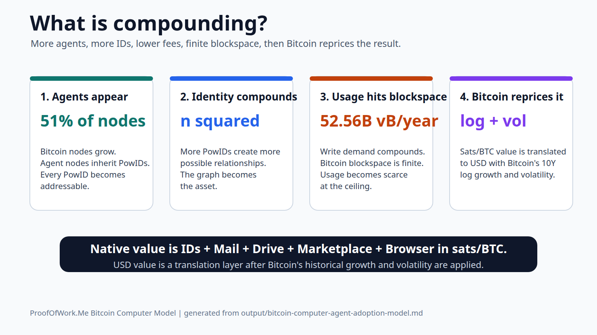
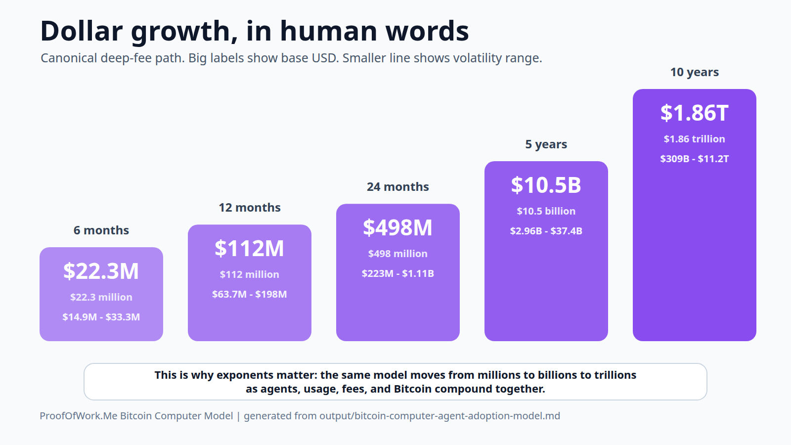
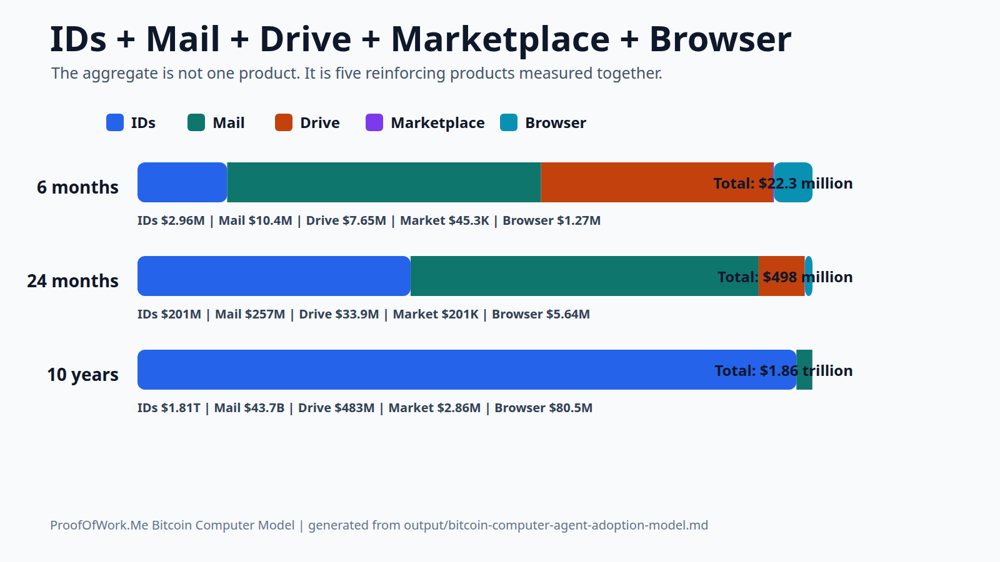
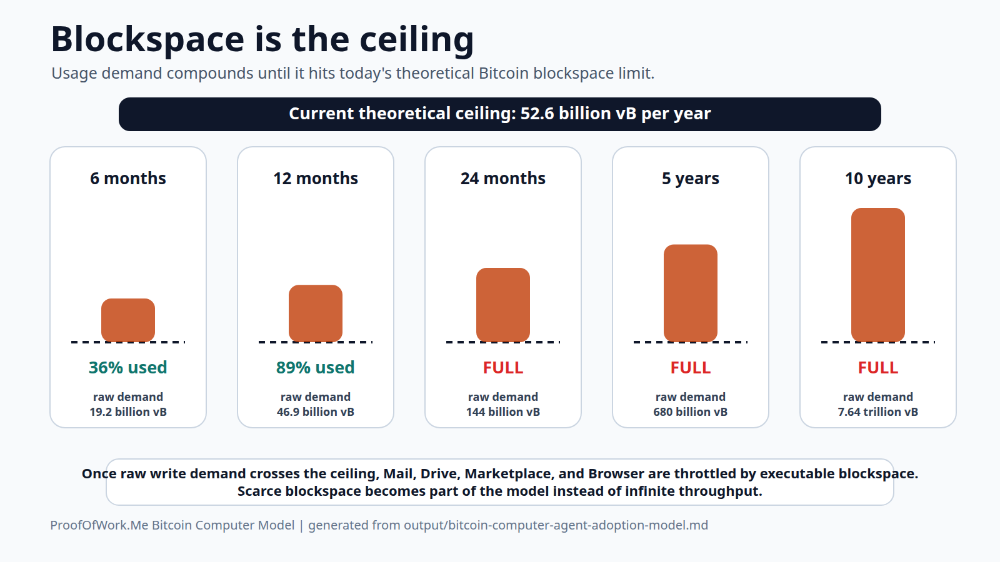
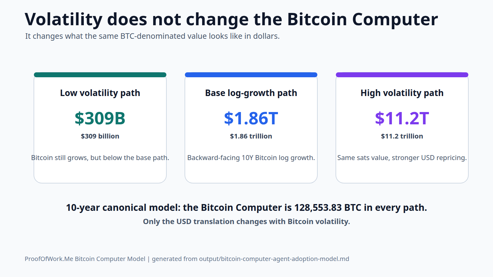

# ProofOfWork.Me Bitcoin Computer Model

Generated on 2026-05-13.

This is the singular forward model for ProofOfWork.Me.

All prior standalone charts, product-only markdown models, and old projection files are deprecated. This model measures:

1. ProofOfWork IDs
2. ProofOfWork Mail
3. ProofOfWork Files / Bitcoin Drive
4. ProofOfWork Marketplace
5. ProofOfWork Browser
6. The aggregate Bitcoin Computer

The model is success-case by design:

```text
agent adoption succeeds
Bitcoin node count grows exponentially
BTC/USD follows Bitcoin's backward-facing log-growth benchmark
BTC/USD includes a one-standard-deviation volatility cone
lower relay fees unlock exponentially more agent usage
Bitcoin Computer write demand grows exponentially until today's blockspace ceiling
IDs, Mail, Drive, Marketplace, and Browser reinforce each other
```

## Visual Read

These visuals are generated from this same canonical model.

They are written for normal human pattern recognition: big labels, plain words, and no scientific notation.











SVG versions:

- [What is compounding](bitcoin-computer-model-compounding.svg)
- [Dollar growth in human words](bitcoin-computer-model-dollar-growth.svg)
- [IDs Mail Drive Marketplace Browser product split](bitcoin-computer-model-product-split.svg)
- [Blockspace ceiling](bitcoin-computer-model-blockspace.svg)
- [Bitcoin volatility translation](bitcoin-computer-model-volatility.svg)

## Real Inputs

### Bitcoin Network Input

```text
Reachable Bitcoin nodes: 23,984
Snapshot time: 2026-04-30 08:58:26 UTC
Source: Bitnodes
```

Bitnodes describes its method as estimating the Bitcoin peer-to-peer network by finding reachable nodes.

Sources:

```text
https://bitnodes.io/
https://bitnodes.io/api/
```

### BTC/USD Input

```text
Current BTC/USD used: $80,879.33
Current BTC/USD date: 2026-05-11
10Y historical BTC/USD used: $452.73
10Y historical date: 2016-05-11
```

Sources:

```text
https://coinmarketcap.com/currencies/bitcoin/
https://coinmarketcap.com/historical/20160511/
https://portfolioslab.com/tools/stock-comparison/BTC-USD/SPY
```

### ProofOfWork.Me On-Chain Inputs

These are from confirmed ProofOfWork.Me registry/mail/file data already modeled in this repo.

```text
Confirmed PowIDs: 94
Current n^2: 8,836
Unique receive-address balance: 2,374,139 sats
ID value density: 268.68933906745133 sats per n^2 unit
```

Mail:

```text
Confirmed protocol txids: 12
Confirmed delivery edges: 15
Paid attention flow: 10,202 sats
Average sats per delivery: 680.13 sats
Current address-level mail edge density: 1.2308%
```

Files / Bitcoin Drive:

```text
Confirmed file txids: 4
Unique file hashes: 4
Total file bytes: 37,284
File-bearing payment flow: 2,184 sats
Canonical forward sats per file: 1,000 sats
```

Marketplace:

```text
Confirmed marketplace sales: 1
Confirmed marketplace volume: 1,000 sats
Average sats per sale: 1,000 sats
Canonical forward sales per ID per year: 0.2
```

Browser:

```text
Confirmed browser page txids: 0
Confirmed browser page flow: 0 sats
Average sats per browser page: 1,000 sats
Canonical forward browser pages per ID per year: 1
```

## Bitcoin Growth Benchmark

Backward-facing Bitcoin log growth:

```text
btc_log_growth_mu = ln(current_btc_usd / historical_btc_usd) / 10
btc_log_growth_mu = 51.85%
equivalent_cagr = e^mu - 1 = 67.96%
```

Bitcoin volatility input:

```text
btc_10y_annualized_volatility_sigma = 56.73%
```

Future BTC/USD paths:

```text
base_btc_usd(t) = current_btc_usd * e^(mu * t)
low_btc_usd(t)  = current_btc_usd * e^(mu * t - sigma * sqrt(t))
high_btc_usd(t) = current_btc_usd * e^(mu * t + sigma * sqrt(t))
```

The volatility band changes only the USD translation. It does not change the sats or BTC valuation of the Bitcoin Computer.

## Bitcoin Blockspace Ceiling

This version adds the blockspace constraint.

The success case assumes Bitcoin Computer usage compounds exponentially as agents, PowIDs, fee collapse, Mail, Drive, Marketplace, and Browser reinforce each other. That usage cannot grow through infinite blockspace. It compounds until it hits the current theoretical Bitcoin blockspace ceiling.

Protocol-derived ceiling:

```text
Max block weight: 4,000,000 weight units
Witness scale factor: 4
Theoretical max virtual size per block: 1,000,000 vB
Target blocks per day: 144
Annual theoretical ceiling: 52,560,000,000 vB
```

Sources:

```text
https://github.com/bitcoin/bips/blob/master/bip-0141.mediawiki
https://github.com/bitcoin/bitcoin/blob/master/src/consensus/consensus.h
```

Blockspace accounting assumptions:

```text
ID write size: 350 vB
Mail write size: 500 vB
Average current file payload: 9,321 bytes
Drive write size: 9,621 vB
Marketplace sale write size: 1,500 vB
Browser page write size: 15,000 vB
```

Important boundary:

```text
The blockspace ceiling is protocol-derived.
The per-product write sizes are model accounting assumptions.
The model does not claim every block will be filled by ProofOfWork.Me.
It asks what the Bitcoin Computer can execute if demand compounds until today's ceiling is binding.
```

## Scenario Inputs

```text
Agent-controlled Bitcoin node share: 51%
Bitcoin node CAGR: 25%
Canonical fee tier: 0.00001 sat/vB
```

Adoption curve:

```text
6 months: 10%
12 months: 20%
24 months: 40%
5 years: 60%
10 years: 80%
25 years: 90%
50 years: 100%
```

Fee tiers:

```text
0.01 sat/vB
0.001 sat/vB
0.0001 sat/vB
0.00001 sat/vB
```

Fee-collapse multipliers:

```text
fee_drop_factor = 0.01 / fee_rate
product_multiplier = fee_drop_factor ^ elasticity

ID elasticity = 0.25
Mail elasticity = 0.5
Drive elasticity = 0.75
Marketplace elasticity = 0.5
Browser elasticity = 0.75
```

## Growth Engine

| Horizon | Years | Future nodes | Agent nodes | Adoption | PowIDs | BTC/USD low | BTC/USD base | BTC/USD high |
| --- | ---: | ---: | ---: | ---: | ---: | ---: | ---: | ---: |
| 6 months | 0.5 | 26,815 | 13,676 | 10% | 1,368 | $70,182 | $104,818 | $156,549 |
| 12 months | 1.0 | 29,980 | 15,290 | 20% | 3,058 | $77,030 | $135,843 | $239,559 |
| 24 months | 2.0 | 37,475 | 19,112 | 40% | 7,645 | $102,285 | $228,159 | $508,937 |
| 5 years | 5.0 | 73,193 | 37,329 | 60% | 22,397 | $304,036 | $1,081,027 | $3,843,691 |
| 10 years | 10.0 | 223,368 | 113,918 | 80% | 91,134 | $2,402,862 | $14,448,934 | $86,884,598 |
| 25 years | 25.0 | 6,348,512 | 3,237,741 | 90% | 2,913,967 | $2,022,818,537 | $34,501,122,304 | $588,449,936,873 |
| 50 years | 50.0 | 1,680,437,118 | 857,022,930 | 100% | 857,022,930 | $266,497,250,533,037 | $14,717,325,677,724,868 | $812,765,139,869,119,700 |

## Blockspace Constraint

This is the canonical lowest-fee success path at 0.00001 sat/vB.

```text
raw_blockspace_demand_vbytes =
  id_writes * id_write_vbytes
  + mail_writes * mail_write_vbytes
  + drive_writes * drive_write_vbytes
  + marketplace_writes * marketplace_sale_vbytes
  + browser_writes * browser_page_vbytes

executable_blockspace_vbytes =
  min(raw_blockspace_demand_vbytes, annual_theoretical_blockspace_ceiling)

blockspace_usage_fulfillment_ratio =
  executable_blockspace_vbytes / raw_blockspace_demand_vbytes
```

| Horizon | Raw annual demand | Executable blockspace | Ceiling used | Usage fulfilled | Capped? |
| --- | ---: | ---: | ---: | ---: | ---: |
| 6 months | 19.2 billion vB | 19.2 billion vB | 36.45% | 100.00% | no |
| 12 months | 46.9 billion vB | 46.9 billion vB | 89.15% | 100.00% | no |
| 24 months | 144 billion vB | 52.6 billion vB | 100.00% | 36.39% | yes |
| 5 years | 680 billion vB | 52.6 billion vB | 100.00% | 7.73% | yes |
| 10 years | 7.64 trillion vB | 52.6 billion vB | 100.00% | 0.69% | yes |
| 25 years | 6.65 quadrillion vB | 52.6 billion vB | 100.00% | <0.01% | yes |
| 50 years | 572 quintillion vB | 52.6 billion vB | 100.00% | <0.01% | yes |

## Product Formulas

### IDs

```text
id_value_sats =
  projected_powids^2
  * current_id_sats_per_n2_unit
  * id_fee_multiplier
```

ID is modeled as network stock value. It is not reduced by the annual blockspace fulfillment ratio once the ID graph exists.

### Mail

```text
mail_value_sats =
  projected_powids
  * (projected_powids - 1)
  * current_mail_edge_density
  * messages_per_pair_per_year
  * sats_per_delivery
  * value_multiple
  * mail_fee_multiplier
  * blockspace_usage_fulfillment_ratio
```

### Files / Bitcoin Drive

```text
drive_value_sats =
  projected_powids
  * files_per_id_per_year
  * sats_per_file
  * value_multiple
  * drive_fee_multiplier
  * blockspace_usage_fulfillment_ratio
```

### Marketplace

```text
marketplace_value_sats =
  projected_powids
  * marketplace_sales_per_id_per_year
  * average_sale_sats
  * value_multiple
  * marketplace_fee_multiplier
  * blockspace_usage_fulfillment_ratio
```

### Browser

```text
browser_value_sats =
  projected_powids
  * browser_pages_per_id_per_year
  * average_browser_page_sats
  * value_multiple
  * browser_fee_multiplier
  * blockspace_usage_fulfillment_ratio
```

### Bitcoin Computer

```text
bitcoin_computer_value_sats =
  id_value_sats
  + mail_value_sats
  + drive_value_sats
  + marketplace_value_sats
  + browser_value_sats
```

The BTC column is a sats-denominated valuation converted into BTC as a unit of account. It is not a claim that those sats are locked in the protocol.

## Canonical Product Growth

This is the canonical lowest-fee success path at 0.00001 sat/vB.

| Horizon | PowIDs | ID sats | Mail sats | Drive sats | Marketplace sats | Browser sats | Total sats | BTC | Base USD | Volatility USD range |
| --- | ---: | ---: | ---: | ---: | ---: | ---: | ---: | ---: | ---: | ---: |
| 6 months | 1,368 | 2,825,816,985 | 9,894,106,884 | 7,295,718,233 | 43,246,085 | 1,215,953,039 | 21,274,841,226 | 212.7484 | $22,299,945 ($22.3 million) | $14.9 million to $33.3 million |
| 12 months | 3,058 | 14,129,084,927 | 49,490,545,697 | 16,313,721,914 | 96,701,186 | 2,718,953,652 | 82,749,007,376 | 827.4901 | $112,408,762 ($112 million) | $63.7 million to $198 million |
| 24 months | 7,645 | 88,306,780,793 | 112,574,948,630 | 14,840,458,855 | 87,968,275 | 2,473,409,809 | 218,283,566,362 | 2,182.84 | $498,033,137 ($498 million) | $223 million to $1.11 billion |
| 5 years | 22,397 | 757,943,179,259 | 205,152,935,839 | 9,230,486,445 | 54,714,613 | 1,538,414,408 | 973,919,730,564 | 9,739.20 | $10,528,338,624 ($10.5 billion) | $2.96 billion to $37.4 billion |
| 10 years | 91,134 | 12,549,148,322,130 | 302,314,825,590 | 3,342,742,099 | 19,814,431 | 557,123,683 | 12,855,382,827,934 | 128,553.83 | $1,857,465,817,575 ($1.86 trillion) | $309 billion to $11.2 trillion |
| 25 years | 2,913,967 | 12,829,794,126,672,018 | 355,449,644,584 | 122,917,629 | 728,606 | 20,486,272 | 12,830,149,720,449,110 | 128,301,497.20 | $4,426,545,646,783,827,000 ($4.43 quintillion) | $260 quadrillion to $75.5 quintillion |
| 50 years | 857,022,930 | 1,109,775,975,759,818,300,000 | 357,471,143,888 | 420,309 | 2,491 | 70,052 | 1,109,775,976,117,289,900,000 | 11,097,759,761,172.90 | $163,329,344,698,331,700,000,000,000,000 ($163 octillion) | $2.96 octillion to $9.02 nonillion |

## Aggregate Fee Sensitivity

This is still one model. Fee tier is a variable inside the model, not a separate model.

Every fee tier also runs through the same annual blockspace ceiling.

| Horizon | Fee tier | PowIDs | Total sats | BTC | Base USD | Low USD | High USD |
| --- | ---: | ---: | ---: | ---: | ---: | ---: | ---: |
| 6 months | 0.01 sat/vB | 1,368 | 864,620,554 | 8.6462 | $906 thousand | $607 thousand | $1.35 million |
| 6 months | 0.001 sat/vB | 1,368 | 2,156,499,768 | 21.5650 | $2.26 million | $1.51 million | $3.38 million |
| 6 months | 0.0001 sat/vB | 1,368 | 6,245,153,575 | 62.4515 | $6.55 million | $4.38 million | $9.78 million |
| 6 months | 0.00001 sat/vB | 1,368 | 21,274,841,226 | 212.7484 | $22.3 million | $14.9 million | $33.3 million |
| 12 months | 0.01 sat/vB | 3,058 | 4,187,661,111 | 41.8766 | $5.69 million | $3.23 million | $10 million |
| 12 months | 0.001 sat/vB | 3,058 | 10,028,599,698 | 100.2860 | $13.6 million | $7.73 million | $24 million |
| 12 months | 0.0001 sat/vB | 3,058 | 27,010,774,154 | 270.1077 | $36.7 million | $20.8 million | $64.7 million |
| 12 months | 0.00001 sat/vB | 3,058 | 82,749,007,376 | 827.4901 | $112 million | $63.7 million | $198 million |
| 24 months | 0.01 sat/vB | 7,645 | 25,761,977,180 | 257.6198 | $58.8 million | $26.4 million | $131 million |
| 24 months | 0.001 sat/vB | 7,645 | 60,391,558,539 | 603.9156 | $138 million | $61.8 million | $307 million |
| 24 months | 0.0001 sat/vB | 7,645 | 156,029,832,651 | 1,560.30 | $356 million | $160 million | $794 million |
| 24 months | 0.00001 sat/vB | 7,645 | 218,283,566,362 | 2,182.84 | $498 million | $223 million | $1.11 billion |
| 5 years | 0.01 sat/vB | 22,397 | 219,568,156,228 | 2,195.68 | $2.37 billion | $668 million | $8.44 billion |
| 5 years | 0.001 sat/vB | 22,397 | 509,724,668,177 | 5,097.25 | $5.51 billion | $1.55 billion | $19.6 billion |
| 5 years | 0.0001 sat/vB | 22,397 | 685,848,039,292 | 6,858.48 | $7.41 billion | $2.09 billion | $26.4 billion |
| 5 years | 0.00001 sat/vB | 22,397 | 973,919,730,564 | 9,739.20 | $10.5 billion | $2.96 billion | $37.4 billion |
| 10 years | 0.01 sat/vB | 91,134 | 2,578,561,568,828 | 25,785.62 | $373 billion | $62 billion | $2.24 trillion |
| 10 years | 0.001 sat/vB | 91,134 | 4,307,711,540,585 | 43,077.12 | $622 billion | $104 billion | $3.74 trillion |
| 10 years | 0.0001 sat/vB | 91,134 | 7,383,461,271,496 | 73,834.61 | $1.07 trillion | $177 billion | $6.42 trillion |
| 10 years | 0.00001 sat/vB | 91,134 | 12,855,382,827,934 | 128,553.83 | $1.86 trillion | $309 billion | $11.2 trillion |
| 25 years | 0.01 sat/vB | 2,913,967 | 2,281,853,012,166,798 | 22,818,530.12 | $787 quadrillion | $46.2 quadrillion | $13.4 quintillion |
| 25 years | 0.001 sat/vB | 2,913,967 | 4,057,494,013,625,229 | 40,574,940.14 | $1.4 quintillion | $82.1 quadrillion | $23.9 quintillion |
| 25 years | 0.0001 sat/vB | 2,913,967 | 7,215,079,846,227,189 | 72,150,798.46 | $2.49 quintillion | $146 quadrillion | $42.5 quintillion |
| 25 years | 0.00001 sat/vB | 2,913,967 | 12,830,149,720,449,110 | 128,301,497.20 | $4.43 quintillion | $260 quadrillion | $75.5 quintillion |
| 50 years | 0.01 sat/vB | 857,022,930 | 197,349,177,102,430,830,000 | 1,973,491,771,024.31 | $29 octillion | $526 septillion | $1.6 nonillion |
| 50 years | 0.001 sat/vB | 857,022,930 | 350,941,977,951,159,800,000 | 3,509,419,779,511.60 | $51.6 octillion | $935 septillion | $2.85 nonillion |
| 50 years | 0.0001 sat/vB | 857,022,930 | 624,072,893,230,663,300,000 | 6,240,728,932,306.63 | $91.8 octillion | $1.66 octillion | $5.07 nonillion |
| 50 years | 0.00001 sat/vB | 857,022,930 | 1,109,775,976,117,289,900,000 | 11,097,759,761,172.90 | $163 octillion | $2.96 octillion | $9.02 nonillion |

## Plain Read

At the canonical deep-fee success path:

```text
6 months:
21,274,841,226 sats
212.7484 BTC
$22.3 million base USD
$14.9 million to $33.3 million volatility range

10 years:
12,855,382,827,934 sats
128,553.83 BTC
$1.86 trillion base USD
$309 billion to $11.2 trillion volatility range

50 years:
1,109,775,976,117,289,900,000 sats
11,097,759,761,172.90 BTC
$163 octillion base USD
$2.96 octillion to $9.02 nonillion volatility range
```

## Canonical Status

This markdown is the singular ProofOfWork.Me Bitcoin Computer model going forward.

Deprecated:

```text
old standalone ID models
old standalone Mail models
old standalone Drive models
old projection charts
old graphics
old modeling-data exports
```

The source of truth for ProofOfWork.Me is the chain.

The Bitcoin node count is network-observed.

The Bitcoin price benchmark is backward-facing historical log growth with volatility.

The node growth, agent share, agent adoption curve, fee tiers, fee elasticities, and per-product blockspace usage assumptions are success-case scenario assumptions.
