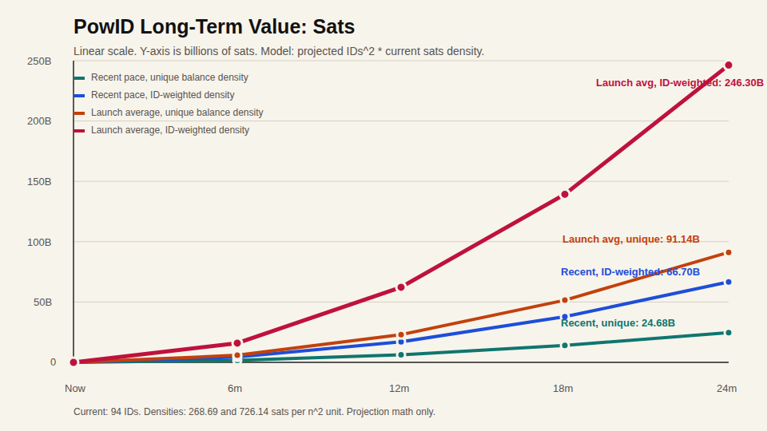
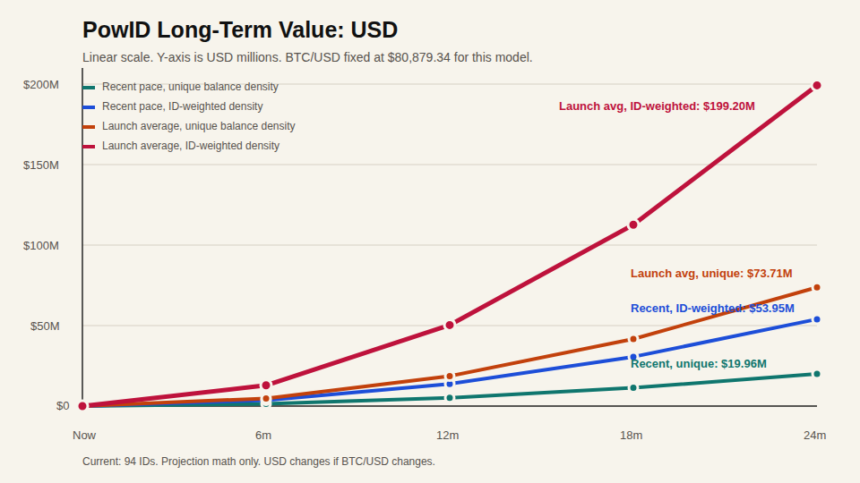

# PowID Long-Term Value Charts

Generated from the 2026-05-11 network-effect model.

Model:

```text
projected value = projected PowIDs^2 * current sats density
```

Current density anchors:

```text
Unique balance density: 268.69 sats per n^2 unit
ID-weighted density: 726.14 sats per n^2 unit
BTC/USD used: $80,879.34
```

## Charts

PNG files are upload-ready for X/Twitter.





SVG versions:

- [PowID long-term sats value](powid-long-term-sats-linear.svg)
- [PowID long-term USD value](powid-long-term-usd-linear.svg)

Data:

- [Modeling data README](modeling-data/README.md)
- [Projection scenarios CSV](modeling-data/powid-projection-scenarios-2026-05-11.csv)
- [Network model JSON](modeling-data/powid-network-model-2026-05-11.json)

## Projection Table

| Period | Recent unique | Recent ID-weighted | Launch avg unique | Launch avg ID-weighted |
|---|---:|---:|---:|---:|
| Now | 0.0237 BTC / ~$1,920 | 0.0642 BTC / ~$5,189 | 0.0237 BTC / ~$1,920 | 0.0642 BTC / ~$5,189 |
| 6 months | 16.4323 BTC / ~$1.33M | 44.4088 BTC / ~$3.59M | 59.0256 BTC / ~$4.77M | 159.5185 BTC / ~$12.90M |
| 12 months | 62.9161 BTC / ~$5.09M | 170.0326 BTC / ~$13.75M | 230.1957 BTC / ~$18.62M | 622.1108 BTC / ~$50.32M |
| 18 months | 139.9859 BTC / ~$11.32M | 378.3161 BTC / ~$30.60M | 515.3322 BTC / ~$41.68M | 1,392.7009 BTC / ~$112.64M |
| 24 months | 246.7994 BTC / ~$19.96M | 666.9828 BTC / ~$53.95M | 911.3563 BTC / ~$73.71M | 2,462.9682 BTC / ~$199.20M |
