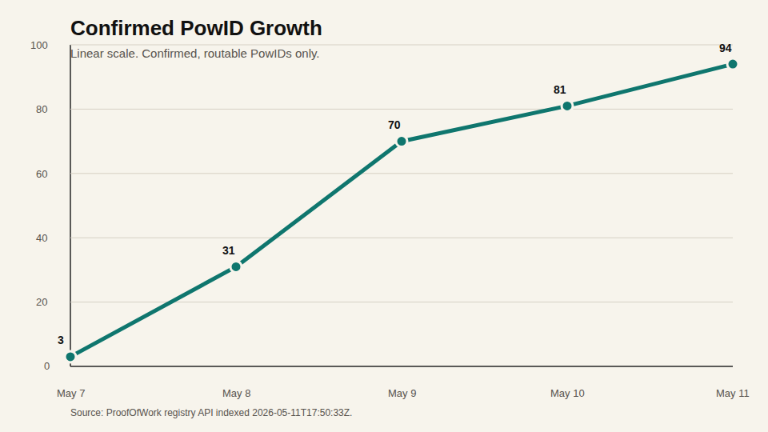
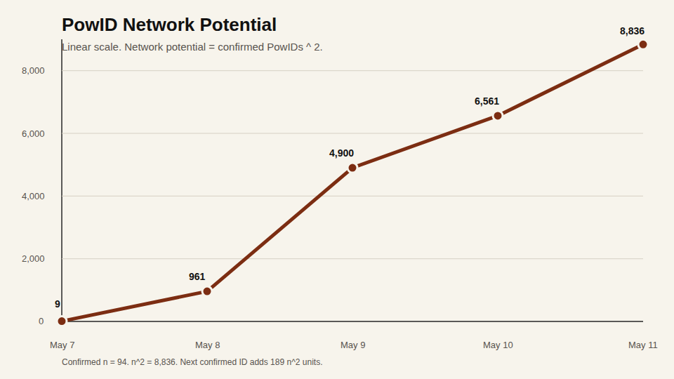
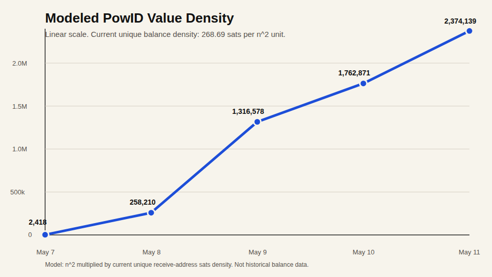
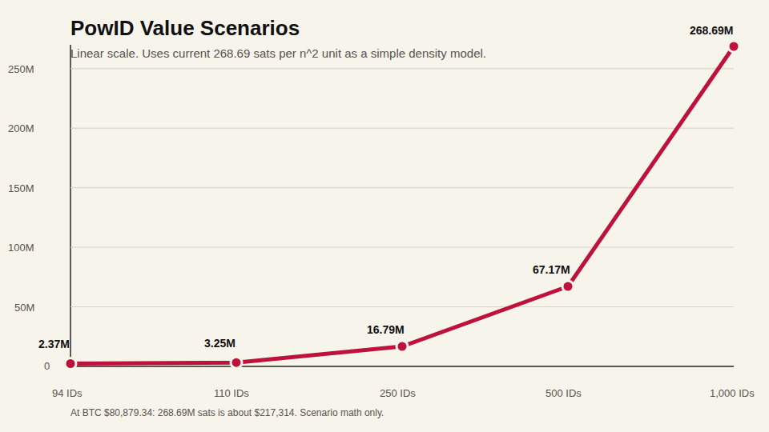

# PowID Network Value Charts

Generated from the live metrics calculated on 2026-05-11 at 17:50:33 UTC.

Confirmed-only unless noted. Pending records are visible, but not final.

## Charts

PNG files are upload-ready for X/Twitter. SVG files are source-quality versions.

Long-term projection pack:

- [PowID long-term value charts](powid-long-term-value-charts.md)
- [PowID modeling data](modeling-data/README.md)
- [PowID mail app value model](powid-mail-app-value-model.md)









SVG versions:

- [Confirmed PowID growth](powid-growth-linear.svg)
- [PowID n squared network potential](powid-n2-linear.svg)
- [Modeled PowID value density](powid-value-density-linear.svg)
- [PowID future value scenarios](powid-future-value-linear.svg)

## Current Metrics

| Metric | Value |
|---|---:|
| Confirmed PowIDs | 94 |
| Pending ID records | 16 |
| Current n^2 potential | 8,836 |
| Directed pair potential | 8,742 |
| Undirected pair potential | 4,371 |
| Unique receive-address balance | 2,374,139 sats |
| ID-weighted balance | 6,416,183 sats |
| Current unique-balance density | 268.69 sats per n^2 unit |
| BTC/USD used | $80,879.34 |
| Unique receive-address balance in USD | ~$1,920.19 |
| ID-weighted balance in USD | ~$5,189.37 |

## Daily Data

| Date | New confirmed PowIDs | Cumulative PowIDs | n^2 potential | Modeled sats at current density |
|---|---:|---:|---:|---:|
| 2026-05-07 | 3 | 3 | 9 | 2,418 |
| 2026-05-08 | 28 | 31 | 961 | 258,210 |
| 2026-05-09 | 39 | 70 | 4,900 | 1,316,578 |
| 2026-05-10 | 11 | 81 | 6,561 | 1,762,871 |
| 2026-05-11 | 13 | 94 | 8,836 | 2,374,139 |

## Scenario Data

This uses the current unique-balance density of `268.69 sats per n^2 unit`.

| Confirmed PowIDs | n^2 potential | Modeled sats | Modeled USD |
|---:|---:|---:|---:|
| 94 | 8,836 | 2,374,139 | ~$1,920 |
| 110 | 12,100 | 3,251,141 | ~$2,630 |
| 250 | 62,500 | 16,793,084 | ~$13,582 |
| 500 | 250,000 | 67,172,335 | ~$54,329 |
| 1,000 | 1,000,000 | 268,689,339 | ~$217,314 |

## Plain Read

```text
94 confirmed PowIDs.
8,836 n^2 potential units.
2,374,139 sats on unique current receive addresses.

Current density:
268.69 sats per n^2 unit.

If all 16 pending IDs confirm:
110 PowIDs.
12,100 n^2 potential units.
3,251,141 modeled sats at current density.
```
